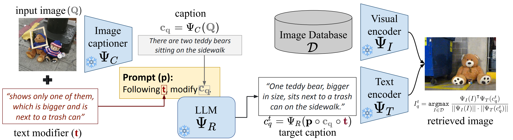

# Official Repository for CIReVL [ICLR 2024]

### Vision-by-Language for Training-Free Compositional Image Retrieval

__Authors__: Shyamgopal Karthik*, Karsten Roth*, Massimilano Mancini, Zeynep Akata

[](https://arxiv.org/abs/2310.09291)
<!-- [](https://github.com/miccunifi/SEARLE) -->
<!-- [](https://paperswithcode.com/sota/zero-shot-composed-image-retrieval-zs-cir-on?p=zero-shot-composed-image-retrieval-with)\
[](https://paperswithcode.com/sota/zero-shot-composed-image-retrieval-zs-cir-on-1?p=zero-shot-composed-image-retrieval-with)\
[](https://paperswithcode.com/sota/zero-shot-composed-image-retrieval-zs-cir-on-2?p=zero-shot-composed-image-retrieval-with) -->

This repo extends the great code repository of [SEARLE](https://arxiv.org/abs/2303.15247), link [here](https://github.com/miccunifi/SEARLE).

---

## Overview

### Abstract

Given an image and a target modification (e.g an image of the Eiffel tower and the text "without people and at night-time"), Compositional Image Retrieval (CIR) aims to retrieve the relevant target image in a database. While supervised approaches rely on annotating triplets that is costly (i.e. query image, textual modification, and target image), recent research sidesteps this need by using large-scale vision-language models (VLMs), performing Zero-Shot CIR (ZS-CIR). However, state-of-the-art approaches in ZS-CIR still require training task-specific, customized models over large amounts of image-text pairs. In this work, we propose to tackle CIR in a training-free manner via our Compositional Image Retrieval through Vision-by-Language (CIReVL), a simple, yet human-understandable and scalable pipeline that effectively recombines large-scale VLMs with large language models (LLMs). By captioning the reference image using a pre-trained generative VLM and asking a LLM to recompose the caption based on the textual target modification for subsequent retrieval via e.g. CLIP, we achieve modular language reasoning. 



In four ZS-CIR benchmarks, we find competitive, in-part state-of-the-art performance - improving over supervised methods. Moreover, the modularity of CIReVL offers simple scalability without re-training, allowing us to both investigate scaling laws and bottlenecks for ZS-CIR while easily scaling up to in parts more than double of previously reported results. Finally, we show that CIReVL makes CIR human-understandable by composing image and text in a modular fashion in the language domain, thereby making it intervenable, allowing to post-hoc re-align failure cases. Code will be released upon acceptance.

---

## Table of Contents

- [Setting everything up](#setting-everything-up)
   - [Required Conda Environment](#required-conda-environment)
   - [Required Datasets](#required-datasets)
- [Running and Evaluation CIReVL](#running-and-evaluating-cirevl-on-all-datasets)
- [Citations](#citation)


---

## Setting Everything Up

### Required Conda Environment

After cloning this repository, install the revelant packages using

```sh
conda create -n cirevl -y python=3.8
conda activate cirevl
pip install torch==1.11.0 torchvision==0.12.0 transformers==4.24.0 tqdm termcolor pandas==1.4.2 openai==0.28.0 salesforce-lavis open_clip_torch
pip install git+https://github.com/openai/CLIP.git
```

__Note__ that to use a BLIP(-2) caption model by default, you need access to GPUs that allow for use of `bloat16` (e.g. `A100` types).

### Required Datasets

#### FashionIQ

Download the FashionIQ dataset following the instructions in
the [**official repository**](https://github.com/XiaoxiaoGuo/fashion-iq). 
After downloading the dataset, ensure that the folder structure matches the following:

```
├── FASHIONIQ
│   ├── captions
|   |   ├── cap.dress.[train | val | test].json
|   |   ├── cap.toptee.[train | val | test].json
|   |   ├── cap.shirt.[train | val | test].json

│   ├── image_splits
|   |   ├── split.dress.[train | val | test].json
|   |   ├── split.toptee.[train | val | test].json
|   |   ├── split.shirt.[train | val | test].json

│   ├── images
|   |   ├── [B00006M009.jpg | B00006M00B.jpg | B00006M6IH.jpg | ...]
```

#### CIRR

Download the CIRR dataset following the instructions in the [**official repository**](https://github.com/Cuberick-Orion/CIRR).
After downloading the dataset, ensure that the folder structure matches the following:

```
├── CIRR
│   ├── train
|   |   ├── [0 | 1 | 2 | ...]
|   |   |   ├── [train-10108-0-img0.png | train-10108-0-img1.png | ...]

│   ├── dev
|   |   ├── [dev-0-0-img0.png | dev-0-0-img1.png | ...]

│   ├── test1
|   |   ├── [test1-0-0-img0.png | test1-0-0-img1.png | ...]

│   ├── cirr
|   |   ├── captions
|   |   |   ├── cap.rc2.[train | val | test1].json
|   |   ├── image_splits
|   |   |   ├── split.rc2.[train | val | test1].json
```

#### CIRCO

Download the CIRCO dataset following the instructions in the [**official repository**](https://github.com/miccunifi/CIRCO).
After downloading the dataset, ensure that the folder structure matches the following:

```
├── CIRCO
│   ├── annotations
|   |   ├── [val | test].json

│   ├── COCO2017_unlabeled
|   |   ├── annotations
|   |   |   ├──  image_info_unlabeled2017.json
|   |   ├── unlabeled2017
|   |   |   ├── [000000243611.jpg | 000000535009.jpg | ...]
```


#### GeneCIS
Setup the GeneCIS benchmark following the instructions in the [**official repository**](https://github.com/facebookresearch/genecis). You would need to download images from the MS-COCO 2017 validation set and from the VisualGenome1.2 dataset. 


---

## Running and Evaluating CIReVL on all Datasets

Exemplary runs to compute all relevant evaluation metrics across all four benchmark datasets are provided in `example_benchmark_runs/example_benchmark_runs.sh` .

For example, to compute retrieval metrics on the Fashion-IQ Dress subset, simply run:

```sh
datapath=/mnt/datasets_r/FASHIONIQ
python src/main.py --dataset fashioniq_dress --split val  --dataset-path $datapath --preload img_features captions mods --llm_prompt prompts.structural_modifier_prompt_fashion --clip ViT-B-32
```

This call to `src/main.py` includes the majority of relevant handles:

```sh
--dataset [name_of_dataset] #Specific dataset to use, s.a. cirr, circo, fashioniq_dress, fashioniq_shirt (...)
--split [val_or_test] #Compute either validation metrics, or generate a test submission file where needed (cirr, circo).
--dataset-path [path_to_dataset_folder]
--preload [list_of_things_to_save_and_preload_if_available] #One can pass img_features, captions and mods (modified captions). Depending on which is passed, the correspondingly generated img_features, BLIP-captions and LLM-modified captions will be stored. If the script is called again using the same parameters, the saved data is loaded instead - which is much quicker. This is particularly useful when switching different models (such as the llm for different modified captions, or the retrieval model via img_features).
--llm_prompt [prompts.name_of_prompt_str] #LLM prompt to use.
--clip [name_of_openclip_model] #OpenCLIP model to use for crossmodal retrieval.
```

---

## Citation

```bibtex
@article{karthik2024visionbylanguage,
  title={Vision-by-Language for Training-Free Compositional Image Retrieval},
  author={Shyamgopal Karthik and Karsten Roth and Massimiliano Mancini and Zeynep Akata},
  journal={International Conference on Learning Representations (ICLR)},
  year={2024}
}

```

